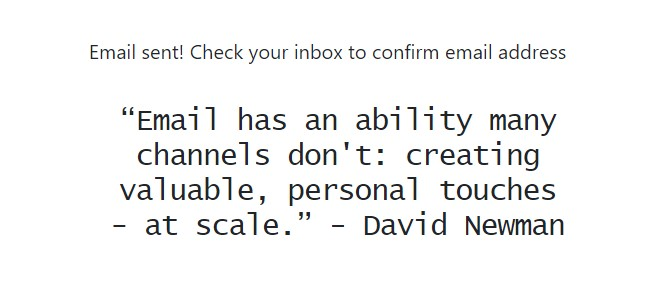

# A Recipe A Day - Email Server

An Emailing Server created using NodeJS, React and MySQL

## Table of Contents
* [General info](#general-info)
* [Technologies](#technologies)
* [Setup](#setup)
* [Working](#working)

## General Info
An Emailing Server that will tell you everything you need to know about awesome new recipes everyday. Clients can subscribe to the email services to get started.

## Technologies
Project is created with:
* NodeJS version : 16.14.0
* React version : 18.2.0
* Bootstrap version : 5.2
* MySQL Community server : 8.0.31

## Setup
Clone this repository using the command : `git clone https://github.com/anmol-ui/A-Recipe-A-Day.git`

* [Setting up Frontend](#setting-up-frontend)
* [Setting up Database](#setting-up-database)
* [Setting up Backend](#setting-up-backend)

### Setting up Frontend
1. Go to the root folder in terminal and install required modules using npm:
```
>npm install
```
2. Run the website using:
```
>npm start
```
3. You'll see the following web page:  


### Setting up Database
1. Open MySQL Workbench
2. Start a new connection with following details:
  * username: root 
  * connection name: localhost
  * password: Anmol123@
3. Open a new SQL tab and execute the query:
```
create database cgas_project;
```
### Setting up Backend
1. cd to the folder named "Server" in terminal and install required modules using npm:
```
>npm install
```
2. Run the server using:
```
>node index.js
```
3. If successfull, you'll see the following:  


## Working
* On the Website homepage, Enter required details and hit the "Get a free subscription" button  
  
  

* An email will be sent with the subject "A Recipe A day". Open the mail to confirm email address.  


Once the email is confirmed, user details will be added in the database and the user will start receiving new recipes from the next day. The time of email is set at 8:00am but can be changed depending upon the preference.


# Email Template

 
 

# Unsubscribe
* Client have the option to Unsubscribe by clicking on the button at the end of the mail.


* On clicking the unsubscribe button, a prompt will appear asking users to confirm their decision.


